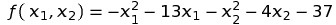
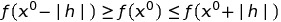
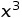
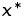

# Лабораторная работа № 6. Безусловный экстремум.

Выполнил студент группы 428  
Мунин Сергей Александрович

## Вариант № 16
Найти точку **максимума**

методом **наискорейшего спуска**. Для одномерной минимизации использовать метод **квадратичной интерполяции**.
Для поиска интервала унимодальности использовать алгоритм **Свенна**.
В окрестности точки максимума построить линии уровня и траекторию поиска (на одном графике).
## Теоретическая часть

Задаём начальное приближение 
Находим формулы компонент градиента функции в произвольной точке 
Далее с помощью алгоритма Свенна, подав на вход приближение  и выбрав шаг, строим широкий интервал. содержащий точку экстремума 
### Алгоритм Свенна
В данном методе используется используется эвристический подход в котором
x
k+1 пробная точка определяется по рекуррентной формуле

где
 - произвольно выбранная начальная точка;
h - шаг поиска, знак которого может меняться на противоположный.
Знак h определяется путем сравнения значений 

 . 
 Если ,то согласно предположению об унимодальности, точка минимума должна располагаться правее точки  и величина h выбирается положительной.
Если ,то величину h следует выбирать отрицательной. Если ,то точка
минимума лежит между  и поиск граничных точек
завершен в противном случае изменить начальную точку. Случай,
когда , противоречит предположению об унимодальности. Выполнение этого условия говорит о том,
что функция в орестности точки  не является унимодальной и
следует изменить начальную точку 

### Метод квадратичной интерполяции

Здесь задаются пробные три пробные точки , одна из которых высчитывается по формуле , как серединная точка интервала из алгоритма Свенна,  и
. Для нахождения точки
задается шаг h > 0 в положительном
направлении от точки
, т.е.  и если
, то, иначе . 
Вычисляются значения функции в этих точках ,
строится квадратичный интерполяционый многочлен по трем точкам и находится его точка минимума по формуле 
 .
Если знаменатель в формуле для нахождения минимума квадратичного интерполяционного многочлена равен нулю, т.е. все три
точки лежат на одной прямой рекомендуется выбрать за 
и повторить нахождение точки 
.
Критерием окончания в этого процесса является выполнение условий для заданного ϵ

Если условия окончания не выполняются и

точка 
заменяется на точку , в противном случае точка 
заменяется 

### Метод наискорейшего спуска
 Метод наискорейшего спуска. В этом методе αk выбирается из условия минимума функции  вдоль направления  
, т.е.
. 
Таким образом, в методе наискорейшего спуска на каждом шаге
необходимо решать задачу минимизации функции одной переменной, что и выполняется в ранее описанных методах.

## Практическая часть
Практическая часть. 
Программа состоит из нескольких функций:  
1. main - основная функция. 
2. SteepDescent - наибыстрейший спуск, в ней происходит вызов всех следующих функций. 
3. Grad - нахождения градиента. 
4. CBEHHA - алгоритм Свенна. 
5. qinter - квадратичная интерполяция. 
Более подробно структура программы представлена на блок-схемах в приложении к отчёту (после вывода ).

Функция SteepDescent принимает в качестве параметра файловый поток вывода, в который в конечном счёте записывает найденные точки. 
В начале выполнения вызывается функция Grad, которая находит направление наибыстрейшего убывания функции, 
полученный градиент вместе с параметром alpha, который зануляется на каждой итерации, отправляет в качестве параметра в функцию 
CBEHHA, данная функция выполняет поиск интервала унимодальности, т.е. интервала вхождения минимума, присваивая значениям a и b значения  крайних точек интервала. 
Далее вычисляется значение alpha путём вызова функции qinter, данная функция в качестве параметров принимает текущее значение alpha, а  также значение градиента функции. 
Функция находит значение alpha, путём решения одномерной задачи в интервале найденном в функции CBEHHA, после возвращает alpha обратно в  SteepDescent. 
Далее совершается шаг с коэффициентом alpha в направлении градиента, после проверяются условия окончания итерационного процеса. 
При несоблюдении условий функция начинает свою работу сначала путём вызова SteepDescent. Если условия соблюдены, то функция  возвращает  значения трёх переменных, 
которые соответствуют точке минимума. 

**Порядок компилляции/запуска:** 
1. Компиллируем и запускаем файл **`cod.cpp`** из командной строки при помощи команды: 
`g++ cod.cpp -o cod.o`  
2. Запускаем из командной строки `cod.o`  

### Результаты
В результате работы программы у функции       был найден экстремум в точке (-6.5,-2) за ***1*** итерацию методом наискорейшего спуска
  
