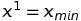

# Лабораторная работа № 6. Безусловный экстремум.

Выполнил студент группы 428  
Мунин Сергей Александрович

## Вариант № 16
Найти точку **максимума**

методом **наискорейшего спуска**. Для одномерной минимизации использовать метод **квадратичной интерполяции**.
Для поиска интервала унимодальности использовать алгоритм **Свенна**.
В окрестности точки максимума построить линии уровня и траекторию поиска (на одном графике).
## Теоретическая часть

Задаём начальное приближение 
Находим формулы компонент градиента функции в произвольной точке 
Далее с помощью алгоритма Свенна, подав на вход приближение  и выбрав шаг, строим широкий интервал. содержащий точку экстремума 
### Алгоритм Свенна
В данном методе используется Используется эвристический подход в котором
x
k+1 пробная точка определяется по рекуррентной формуле

где
 - произвольно выбранная начальная точка;
h - шаг поиска, знак которого может меняться на противоположный.
Знак h определяется путем сравнения значений 

 . 
 Если ,то согласно предположению об унимодальности, точка минимума должна располагаться правее точки  и величина h выбирается положительной.
Если ,то величину h следует выбирать отрицательной. Если ,то точка
минимума лежит между  и поиск граничных точек
завершен в противном случае изменить начальную точку. Случай,
когда , противоречит предположению об унимодальности. Выполнение этого условия говорит о том,
что функция в орестности точки  не является унимодальной и
следует изменить начальную точку 

### Метод квадратичной интерполяции

Здесь задаются пробные три пробные точки , одна из которых высчитывается по формуле , как серединная точка интервала из алгоритма Свенна,  и
. Для нахождения точки
задается шаг h > 0 в положительном
направлении от точки
, т.е.  и если
, то, иначе . 
Вычисляются значения функции в этих точках ,
строится квадратичный интерполяционый многочлен по трем точкам и находится его точка минимума по формуле 
 .
Если знаменатель в формуле для нахождения минимума квадратичного интерполяционного многочлена равен нулю, т.е. все три
точки лежат на одной прямой рекомендуется выбрать за 
и повторить нахождение точки 
.
Критерием окончания в этого процесса является выполнение условий для заданного ϵ

Если условия окончания не выполняются и

точка 
заменяется на точку , в противном случае точка 
заменяется 

### Метод наискорейшего спуска
 Метод наискорейшего спуска. В этом методе αk выбирается из условия минимума функции  вдоль направления  
, т.е.
. 
Таким образом, в методе наискорейшего спуска на каждом шаге
необходимо решать задачу минимизации функции одной переменной, что и выполняется в ранее описанных методах.

## Практическая часть
Моя работа состоит из 2-х программ:  
1) Программа с реализацией поиска экстремума ф-ции, написанная на языке C++ 
2) Программа для отрисовки линий уровня ф-ции и траектории поиска экстремума, написанная на Python  

Программа на C++ состоит из 1-го файла **`Labb6.cpp`**  

Структура программы: 
* В начале программы продключаются библиотеки:  
     `iostream` - стандартная библиотека ввода/вывода 
     `cmath` - стандартная библиотека для выполнения математических операций  
     `fstream` - библиотека для чтения/записи данных из/в файл  
* `double F(double x1, double x2)` - функция 2-х переменных, которая дана в билете 
* `double grad1(double x1, double x2)` - 1-ая компонента вектора градиента исходной ф-ции 
* `double grad2(double x1, double x2)` - 2-ая компоненту вектора градиента исходной ф-ции 
* В классе `Sopr` описаны переменные и методы, необходмые для отыскания точки экстремума:
  * *private* - методы и переменные класса: 
    * `h` - произвольный шаг, используемый в методе квадратичной интерполяции и методе нахождения интервала унимодальности
    * `k` - счетчик итераций в методе сопряженных градиентов
    * двумерные статические массивы `x0` и  `x1` для записи предыдущего и последующего приближения точки экстремума функции
    * двумерные статические массивы `p0` и  `p1` для записи предыдущего и последующего значений вектора направления                             в методе сопряж-х град-в
    * `fout` - объект класса ofstream для записи в файл новых значений вектора   
    * ` double f(double alfa)` - та же функция `double F(double x1, double x2)`, только для случая, когда переменные x1 и x2 в свою очередь зависят от  . Она необходима для поиска экстремума ф-ции одной переменной в методе квадратичной интерп-ции
    * `double interpMnogochlen(double& x1, double& x2, double& x3)` - квадратичный интерполяционный многочлен, используемый в методе квадр-й интерполяции
    * 'double argmin(double x1, double x2, double x3)' - возвращает один из 3-х аргументов, при котором исходная ф-ция имеет наименьшее значение
    * 'double argmin(double x1, double x2)' - возвращающает один из 2-х аргументов, при котором исходная ф-ция имеет наименьшее значение
    
  * *public* - методы и переменные класса:
    * `int GetIter()` - возвращающает кол-во итераций, за которое удалось найти минимум нашей функции
    * `double* soprGrad()` - реализует *метод сопряженных градиентов*. Возвращает адрес найденной точки минимума.
    * `double KvadrInterp(double a, double b)` - реализует *метод квадратичной интерполяции*. Возвращает минимум ф-ции одной переменной.
    * `void unimodal(double x0, double& a, double& b)` - находит интервал унимодальности нашей ф-ции
   
* В методе `int main()` создается объект типа `Sopr`, у которого вызывается ф-я `soprGrad()`. В консоль выводится найденная точка минимума и кол-во итераций.  
Также ф-я `soprGrad()` создает в папке с программой файл `tr.txt`, в который записываются значения вектора  для построения траектории поиска. 
И в конце с помощью команды `system("linur.py")` вызывается питоновский файл, в котором построенна траектория поиска.  

Программа на Python состоит из 1-го файла **`linur.py`** 

В ней строится картина линий уровня нашей ф-ции с помощью метода `contour()` из библиотеки `pylab` и траектория поиска по данным из файла `tr.txt`. 

**Порядок компилляции/запуска:** 
1. Компиллируем и запускаем файл **`cod.cpp`** из командной строки при помощи команды: 
`g++ cod.cpp -o cod.o`  
2. Запускаем из командной строки `cod.o`  

### Результаты
В результате работы программы у функции       был найден экстремум в точке   (начальная точка  ) за ***1*** итерацию методом наискорейшего спуска
  
